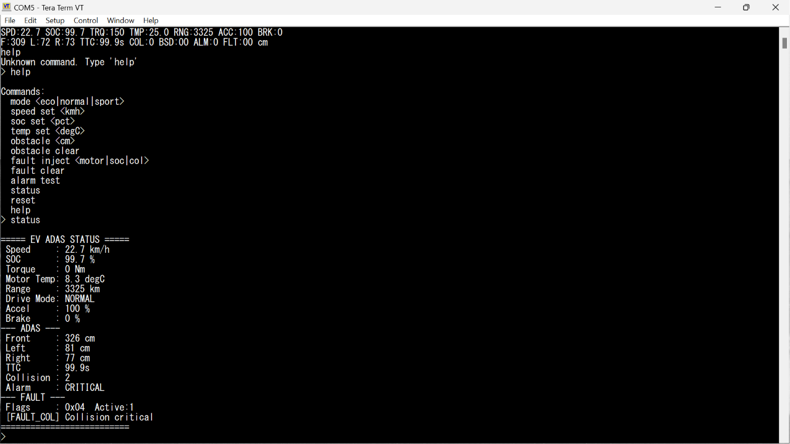

# EV ADAS Dashboard

A real-time Electric Vehicle monitoring and driver-assistance system built on the STM32F103 (Blue Pill), simulated in PICSimLab, with a live Python dashboard.

Built as part of a 1-month online embedded systems internship at [Emertxe Information Technologies](https://www.emertxe.com/).

[](https://youtu.be/Py86phKZBAQ)

*Click the thumbnail above to watch the full demo video.*

---

## Why this project

Modern EVs generate a lot of real-time sensor data at once — speed, battery charge, motor temperature, torque, and range. Without a single place to view all of it, an engineer has no easy way to track EV performance and safety data together. Collisions, blind spots, and faults can easily go unnoticed if someone is watching numbers manually.

This project builds a centralized dashboard that solves that: it reads live sensor data on an STM32 microcontroller, runs collision/blind-spot detection logic, manages faults, and streams everything to a Python dashboard for real-time viewing.

---

## What it does

- Monitors vehicle speed, battery SOC, motor torque, temperature, and estimated range in real time
- Detects forward collisions and calculates Time-to-Collision (TTC)
- Detects vehicles in the blind spot on both sides
- Gives parking assist feedback at low speed
- Warns on overspeeding
- Detects faults (overheating, low battery, critical collision, sensor/communication timeout) and safely cuts motor torque when needed
- Sends live telemetry over UART to a Python dashboard with 5 live panels
- Supports a UART shell to manually inject test values (speed, SOC, temperature, faults) without touching real sensors

---

## Tech Stack

| Layer | Tool/Tech |
|---|---|
| Microcontroller | STM32F103C8T6 (Blue Pill) |
| Simulation | PICSimLab |
| Firmware | Embedded C (STM32 HAL) |
| Sensors | HC-SR04 Ultrasonic (Front, Left, Right), Potentiometers (ADC) |
| Communication | UART @ 115200 bps |
| Virtual COM Port | VSPE (Virtual Serial Ports Emulator) |
| Serial Terminal | TeraTerm |
| Dashboard | Python, matplotlib, pyserial, numpy |

---

## System Architecture

```
Sensors (Simulated) → STM32 Blue Pill → UART (115200 bps) → Python Dashboard
   Potentiometers        EV Control          Telemetry           Speedometer
   (Accel, Brake,        ADAS Engine         Frames              SOC Bar
   Temp, SOC)            Fault Handler       (Line 1 + 2)        ADAS Bird-Eye
```

**Data flow:** Sensors → STM32 ADC → EV/ADAS Engine → UART Serial → Python Parser → Matplotlib Dashboard

---

## Module Breakdown

| File | Responsibility |
|---|---|
| `Core/Src/ev_control.c` | Speed, torque, SOC, range, drive mode logic |
| `Core/Src/adas.c` | Collision detection, TTC, blind spot, parking assist |
| `Core/Src/ultrasonic.c` | HC-SR04 trigger-echo handling, distance calculation |
| `Core/Src/fault.c` | Fault detection and safe-state handling |
| `Core/Src/uart_shell.c` | Serial command parser for manual testing |
| `Core/Src/main.c` | Timer setup, main loop, module integration |
| `Core/Inc/common.h` | Shared type definitions and constants |
| `dashboard/ev_dashboard.py` | Live Python dashboard (matplotlib) |

---

## ADAS Logic & Thresholds

**Forward Collision Warning (FCW)**
- Warning: distance < 50 cm
- Critical: distance < 20 cm
- Uses a 3-sample hysteresis filter to avoid false alarms from noisy sensor readings

**Time-to-Collision (TTC)**
- TTC = distance / relative speed
- Warning below 3.0 s, Critical below 1.5 s

**Blind Spot Detection (BSD)**
- Active only when speed > 20 km/h
- Triggers when an object is within 30 cm on either side

**Parking Assist**
- Active only when speed < 10 km/h
- Score (0–100) calculated from the average of all 3 sensors

**Overspeed Advisory**
- Triggers above 120 km/h, independent of obstacle state

---

## Fault Detection

Faults are tracked using a single-byte bit-field (`uint8_t`), so multiple faults can be active at once:

| Bit | Fault | Trigger Condition |
|---|---|---|
| 0 | FAULT_OT | Motor temperature > 90°C |
| 1 | FAULT_SOC | Battery SOC < 2% |
| 2 | FAULT_COL | Collision critical (< 20 cm) |
| 3 | FAULT_SEN | Ultrasonic sensor timeout |
| 4 | FAULT_COM | UART communication timeout |

On any fault: motor torque is cut to zero, drive state switches to `FAULT`, and the fault LED latches on until cleared.

**Alarm priority levels:**

| Level | Condition |
|---|---|
| ALARM_NONE (0) | Normal operation |
| ALARM_ADVISORY (1) | Blind spot detected or speed > 120 km/h |
| ALARM_WARNING (2) | Collision < 50 cm or TTC < 3 s |
| ALARM_CRITICAL (3) | Collision < 20 cm or TTC < 1.5 s — dashboard flashes red |

---

## UART Telemetry Protocol

Two structured ASCII frames are sent every 100 ms at 115200 bps:

**Line 1 — EV Frame**
```
SPD:72.5 SOC:79.3 TRQ:75 TMP:27.1 RNG:2600 ACC:50 BRK:0
```

**Line 2 — ADAS Frame**
```
F:40 L:400 R:400 TTC:2.1s COL:1 BSD:10 ALM:2 FLT:04
```

| Field | Meaning |
|---|---|
| SPD | Vehicle speed (km/h) |
| SOC | State of Charge (%) |
| TRQ | Motor torque (Nm) |
| TMP | Motor temperature (°C) |
| RNG | Estimated range (km) |
| F / L / R | Ultrasonic distance, front/left/right (cm) |
| TTC | Time-to-collision (s) |
| COL | Collision level (0–2) |
| BSD | Blind spot left/right bits |
| ALM | Alarm priority (0–3) |
| FLT | Fault byte (hex) |

---

## UART Shell Commands

Used to test the system by injecting values manually, sent through a serial terminal (TeraTerm) connected to PICSimLab's virtual COM port, instead of relying on the simulated potentiometers:

| Command | Effect |
|---|---|
| `mode <eco\|normal\|sport>` | Set drive mode |
| `speed set <kmh>` | Inject vehicle speed directly |
| `soc set <pct>` | Override battery SOC |
| `temp set <degC>` | Override motor temperature |
| `obstacle <cm>` | Inject a front obstacle distance |
| `obstacle clear` | Clear the injected obstacle |
| `fault inject <motor\|soc\|col>` | Manually trigger a specific fault |
| `fault clear` | Clear all active faults |
| `alarm test` | Trigger a test alarm |
| `status` | Print full EV + ADAS state summary |
| `reset` | Reset the system to default state |
| `help` | List all available commands |

**TeraTerm shell in action — `status` command output:**



---

## Python Dashboard

Five live panels, refreshed at 10 fps:

- **Speedometer** — circular gauge, 0–200 km/h, color-coded green → orange → red
- **Battery (SOC)** — horizontal bar with live % and estimated range, drive mode shown below
- **Speed History** — rolling 60-sample line chart of vehicle speed
- **EV Metrics Panel** — torque, accel %, brake %, motor temp, alarm level, fault code
- **ADAS Bird-Eye View** — top-down view showing ego vehicle, obstacles, and blind spot zones

**Run with hardware/simulator:**
```bash
python dashboard.py --port COM3
```

**Run in demo mode (no hardware needed):**
```bash
python dashboard.py --demo
```

---

## Results

Two separate testing methods were used, since TeraTerm and the Python dashboard can't both read the same virtual COM port at once (only one client can hold the port at a time).

**Logic verification — via TeraTerm shell commands**

A virtual COM port pair was set up using VSPE, connecting PICSimLab on one end and TeraTerm on the other. All 7 UART shell commands (`speed`, `soc`, `temp`, `mode`, `fault`, `reset`, `status`) were tested this way, injecting specific values directly to confirm firmware behavior:

- **Forward Collision Warning:** Verified WARNING triggers at the 50 cm threshold and CRITICAL at 20 cm by injecting distance values around those boundaries. The 3-sample hysteresis filter was checked by injecting values that hover near the threshold, confirming it doesn't cause rapid alarm flicker.
- **Blind Spot Detection:** Confirmed BSD stays inactive below 20 km/h even with an object within 30 cm (speed gate working correctly), and activates as expected above 20 km/h.
- **Motor over-temperature fault:** Injected temperature values above 90°C; confirmed torque drops to 0, drive state switches to `FAULT`, and the fault LED latches until `reset` is issued.
- **Speed/SOC tracking:** Verified using the `speed` and `soc` commands across their full ranges, including regen behavior (SOC increases when braking above 5% while moving).

**Visual/pipeline verification — via PICSimLab simulated sensors (shown in the demo video)**

Since TeraTerm had to be closed to free the COM port for the dashboard, the demo video shows the full sensor-to-dashboard pipeline instead, driven by varying PICSimLab's simulated potentiometers and sensors directly:

- All 5 dashboard panels (speedometer, SOC bar, speed history, metrics, ADAS bird-eye) confirmed to refresh at the expected 10 fps rate
- End-to-end data flow confirmed working live: PICSimLab sensor changes → STM32 firmware → UART → Python dashboard update

---

## Known Limitations

- This is a simulated prototype built in PICSimLab, not a physical hardware build
- Sensor inputs are simulated using potentiometers, not real HC-SR04 hardware in this version
- No buzzer/audio alerts implemented — alerts are visual only (LED + dashboard)

---

## Acknowledgment

This project was built during a 1-month online internship at Emertxe Information Technologies, under their embedded systems program.

---

## Folder Structure

```
EV_ADAS_Dashboard/
├── Core/
│   ├── Inc/
│   │   ├── adas.h
│   │   ├── common.h
│   │   ├── ev_control.h
│   │   ├── fault.h
│   │   ├── main.h
│   │   ├── uart_shell.h
│   │   ├── ultrasonic.h
│   │   ├── stm32f1xx_hal_conf.h
│   │   └── stm32f1xx_it.h
│   └── Src/
│       ├── adas.c
│       ├── ev_control.c
│       ├── fault.c
│       ├── main.c
│       ├── uart_shell.c
│       ├── ultrasonic.c
│       ├── stm32f1xx_hal_msp.c
│       ├── stm32f1xx_it.c
│       ├── system_stm32f1xx.c
│       ├── syscalls.c
│       └── sysmem.c
├── dashboard/
│   └── ev_dashboard.py
├── .settings/
├── .cproject
├── .project
├── .mxproject
├── .gitignore
├── STM32F103C8TX_FLASH.ld
├── ev_dash.ioc        # STM32CubeMX project file
└── README.md
```

---

## How to Run This Project

**Firmware (STM32CubeIDE + PICSimLab):**
1. Clone this repo
2. Open STM32CubeIDE → File → Import → Existing Projects into Workspace → select the cloned folder
3. Build the project (Project → Build All)
4. Open the generated `.elf`/`.bin` in PICSimLab, configure it as an STM32F103C8T6 (Blue Pill) board
5. Run the simulation

**Python Dashboard:**
```bash
pip install pyserial matplotlib numpy
python dashboard.py --port COM3     # connect to PICSimLab's virtual COM port
# or
python dashboard.py --demo          # run without hardware/simulator
```

---

## What I Learned

A lot of the real learning came from debugging, not just building:

- **Timer conflict:** TIM1 wasn't firing at all initially. Traced it to an unused PWM Channel 1 configuration in CubeMX that was silently blocking the timer interrupt — removing that config fixed it.
- **Noisy sensor readings:** Raw HC-SR04 distance values were jumping around enough to cause false alarm triggers. Fixed this with a median-of-3 filter and by widening the TIM3 sampling period.
- **UART shell reliability:** The TeraTerm-based shell had issues with local echo, line-ending mismatches, and the RX interrupt not being re-armed correctly after each command — all had to be debugged individually to get reliable command handling.
- **Python-side COM port targeting:** Getting pyserial to consistently connect to the correct virtual COM port (set up through VSPE) took some trial and error, especially since TeraTerm and the dashboard script can't share the same port simultaneously.

This project gave me hands-on experience with the full pipeline of an embedded system — from raw sensor signals, through real-time firmware logic, to a live visualization layer — which is close to how an actual automotive ADAS system is structured end to end.